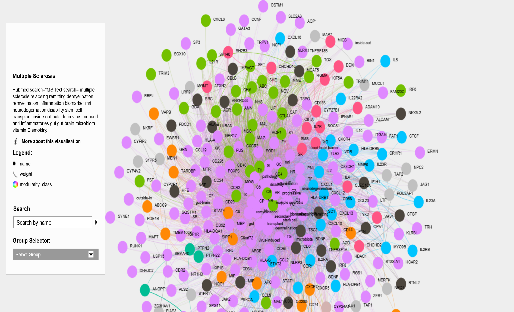

```{r setup, include=FALSE}
knitr::opts_chunk$set(echo = TRUE)
```

## R Markdown

This is an R Markdown document. Markdown is a simple formatting syntax for authoring HTML, PDF, and MS Word documents. For more details on using R Markdown see <http://rmarkdown.rstudio.com>.

When you click the **Knit** button a document will be generated that includes both content as well as the output of any embedded R code chunks within the document. You can embed an R code chunk like this:

```{r library}

library(pubmed.mineR)
library(lsa)
library(SnowballC)
library(wordcloud)
library(DT)

#abstracts=readabs("pubmed_result_ssms.txt") 
#"multiple sclerosis" secondary progressive

#abstracts=readabs("pubmed_result_ms.txt") #
abstracts=readabs("pubmed_result2.txt") #12/12/19
#"multiple sclerosis"

pmids=abstracts@PMID
gene=gene_atomization(abstracts)
words=word_atomizations(abstracts)
#summary(gene)

abstract.bodies=abstracts@Abstract
#SentenceToken(abstract.bodies[1])
Myelin=searchabsL(abstracts)
Con=Find_conclusion(abstracts) #conclusion of abstracts

#create list of words
tdm_wordsA=c("multiple sclerosis","relapsing remitting","progressive","inside-out","outside-in", "secondary","demyelination", "remyelination",  "biomarker","mri", "pathology" ,"neurodegeneration","disability", "stem cell","transplant","inflammation","virus-induced","anti-inflammatories","blood brain barrier","gut","gut-brain","microbiota") 

#create list of gene
#take gene data from first column
tdm_wordsG=gene[,1] 

#merge the 2 word lists
tdm_wordsAG=c(tdm_wordsA,tdm_wordsG)

#create term document matrix
tdmAG=tdm_for_lsa(Myelin,tdm_wordsAG)

#plot wordcloud
m <- as.matrix(tdmAG)
v <- sort(rowSums(m),decreasing=TRUE)
d <- data.frame(word = names(v),freq=v)
head(d, 10)


set.seed(1234)
wordcloud(words = d$word, freq = d$freq, min.freq = 1,
          max.words=200, random.order=FALSE, rot.per=0.35, 
          colors=brewer.pal(8, "Dark2"))

barplot(d[1:20,]$freq, las = 2, names.arg = d[1:20,]$word,
        col ="lightblue", main ="Most frequent words",
        ylab = "Word frequencies")


## latent semantic analysis
lsaspace=lsa(tdmAG,dims=dimcalc_share());
newmatrix=as.textmatrix(lsaspace)
associated_words=lapply(tdm_wordsAG,function(x){associate(newmatrix,x,measure="cosine",threshold="0.5")})
names(associated_words)=tdm_wordsAG
associated_words[1:10]
cos_sim_calc(tdmAG) #output file cosimdata.txt #cytoscape
cos=read.table("cossimdata.txt",header=FALSE,sep="\t")
#write.csv(cos, "cossimdata.csv")
```

```{r plot}

library(dplyr)
cos2=na.omit(cos)

library(igraph)
library(ggraph)
library(graphlayouts)

#relavel column
relations <- data.frame(from=cos2[,1], to=cos2[,2],   weight=abs(cos2[,3]))

#remove 0
relations2=relations[-row(relations)[relations == 0],] 

#undirected graph
g.1a <- graph.data.frame(relations2, directed=FALSE)
#V(g.1a)$size<-1
min<-.99 #threshold


#Give the graph lots of room
#opar <- par()$mar; par(mar=rep(3, 4)) 
#plot(g.1a, layout=layout1)

#plot(g.1a, layout=layout1, edge.width=ifelse(E(g.1a)$weight>=min, E(g.1a)$weight, NA)) 

#waltrap community
wc=cluster_walktrap(g.1a) 
modularity(wc)

#ebc<-edge.betweenness.community(g.1a)

#ci<-cluster_infomap(g.1a)


#
#layout1 <- layout.auto(g.1a)
layout1<-layout.lgl(g.1a)
plot(wc,g.1a, layout=layout1, vertex.size=.5,vertex.label=NA) #remove vertex label

layout2<-layout.fruchterman.reingold(g.1a)
plot(wc,g.1a, layout=layout2) #remove vertex label

V(g.1a)$color<-wc$membership

write.graph(g.1a,"ms.graphml",format = "graphml")


#heatmap
netm <- get.adjacency(g.1a, attr="weight", sparse=F) 
palf <- colorRampPalette(c("gold", "dark orange")) 
heatmap(netm[,17:1], Rowv = NA, Colv = NA, col = palf(100), scale="none", margins=c(10,10) )


```

```{r sigmajs}
library(sigmajs)
gexf<-"ms_network_graph.gexf"
sigmajs() %>% 
 sg_from_gexf(gexf) 

library(dplyr)
msnet<-read.csv("ms_network_graph.gexf.csv")
msnet_edge<-read.csv("ms_network_edge_graph.gexf.csv")
nodes<-msnet %>% select (Id, Label, v_name, modularity_class,Degree ) %>%
  rename(id=Id,
         label=Label,
         size=Degree)

edges<-msnet_edge %>% select (Id, Source, Target) %>%
  rename(id=Id,
         source=Source,
         target=Target)
  

sigmajs() %>% # initialise
  sg_nodes(nodes, id, label, size) %>% # add nodes
  sg_edges(edges, id, source, target) %>% # add edges
  sg_layout() %>%  # layout
  sg_cluster() %>% # cluster
  sg_drag_nodes() %>% # allows user to drag nodes
  sg_neighbours() # show node neighbours on node click

```

use modularity output from gephi
mod<-read.csv("ms_node_graph.csv")

g.1a<-simplify(g.1a)
#V(g.1a)$grp <- as.character(wc$membership) #walktrap

mod$modularity_class[mod$modularity_class>4]<-5

V(g.1a)$grp <- as.character(mod$modularity_class) 


bb <- layout_as_backbone(g.1a,keep=0.4)
E(g.1a)$col <- T
E(g.1a)$col[bb$backbone] <- T

ggraph(g.1a,layout="manual",node.positions=data.frame(x=bb$xy[,1],y=bb$xy[,2]))+
  geom_edge_link(aes(col=col),width=0.5)+
  geom_node_point(aes(col=grp))+
  scale_color_brewer(palette = "Set1")+
  scale_edge_color_manual(values=c(rgb(0,0,0,0.3),rgb(0,0,0,1)))+
  theme_graph()+
  theme(legend.position = "none")


```{r, out.width="400px" }
#gephi force atlas 2 layout
#linlog mode
#modularity=19
#node size =degree


```


library(sigmaNet)
library(igraph)

#load("ms.graphml")
V(g.1a)$group <- mod$modularity_class

layout <- layout_with_fr(g.1a)

sig <- sigmaFromIgraph(g.1a, layout = layout) %>%
  #addNodeLabels(labelAttr = 'label') %>%
  #addNodeLabels(labelAttr = 'mod$v_name') %>%
  #addEdgeSize(sizeAttr = 'value', minSize = .1, maxSize = 2) %>%
  addNodeSize(sizeMetric = 'degree', minSize = 2, maxSize = 8) %>%
  addNodeColors(colorAttr = 'group', colorPal = 'Set1')
sig

sig <- sigmaFromIgraph(g.1a, layout = layout)
sig %>%
  addNodeSize(oneSize = .5) %>%
  addEdgeSize(oneSize = .2)


Note that the `echo = FALSE` parameter was added to the code chunk to prevent printing of the R code that generated the plot.
